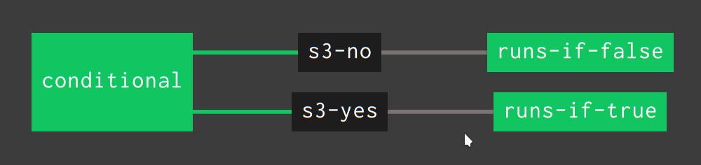
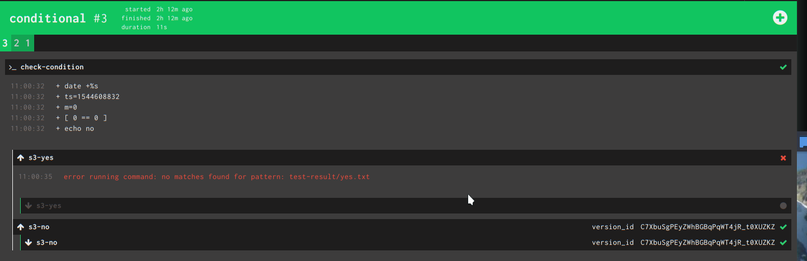

# Concourse conditional

## Problem

I want to be able to execute a part of a pipeline in case of a condition is met, 
or another part if that condition is not met. 

## Use case 1

I want to do database migration just in case I have changes. In a case of 
migration I need to stop my services, do the migration, push the upgrade, start the services. 
But if there is no database migration I just want to do a blug/green deployment.

## Requirements

I assume that you already have a s3 bucket in AWS for this example. 
My bucket is called ``concourse-build`` where I have a ``sample`` folder. 
The credentials for accessing AWS for me are stored in vault/credhub 
with keys: ``aws-access-key-id`` and ``aws-secret-access-key``, but you can 
define them directly or resolve from yml as well.

Resources used:

- s3: https://github.com/concourse/s3-resource

## Idea

Make two s3 versioned resources. One will trigger when condition is met the other one when it is not met. - Of course you can use this as switch-case adding additional s3 resources. 

Create a task that will test the condition and output one specific file (yes.txt) in the output
folder if true, and another file (no.txt) if false.

When the task is finished, on success do a try with setting both files (yes.txt, no.txt). Of 
course one will fail, but try will ignore that. The given file successfully updated will 
trigger the rest of the pipeline.

## Solution





```yml
---
resources:
- name: s3-yes
  type: s3
  source:
    bucket: concourse-build
    versioned_file: sample/yes.txt
    access_key_id: ((aws-access-key-id))
    secret_access_key: ((aws-secret-access-key))
    region_name: eu-west-1
- name: s3-no
  type: s3
  source:
    bucket: concourse-build
    versioned_file: sample/no.txt
    access_key_id: ((aws-access-key-id))
    secret_access_key: ((aws-secret-access-key))
    region_name: eu-west-1

jobs:
- name: conditional
  plan:
  - task: check-condition
    config:
      platform: linux
      image_resource:
        type: docker-image
        source:
          repository: concourse/buildroot
          tag: git
      outputs:
      - name: test-result
      run:
        path: sh
        args:
        - -exc
        - |
          ts=$(date +"%s"); m=$(($ts % 2)); if [ "$m" == 0 ]; then echo "no" > test-result/no.txt ; else echo "yes" > test-result/yes.txt; fi
    on_success:
      try:
        aggregate:
        - put: s3-yes
          params:
            file: test-result/yes.txt
        - put: s3-no
          params:
            file: test-result/no.txt
- name: runs-if-true
  plan:
  - get: s3-yes
    trigger: true
    passed:
    - conditional
  - task: is-true
    config:
      platform: linux
      image_resource:
        type: docker-image
        source:
          repository: concourse/buildroot
          tag: git
      outputs:
      - name: test-result
      run:
        path: sh
        args:
        - -exc
        - |
          echo "TRUE"
- name: runs-if-false
  plan:
  - get: s3-no
    trigger: true
    passed:
    - conditional
  - task: is-true
    config:
      platform: linux
      image_resource:
        type: docker-image
        source:
          repository: concourse/buildroot
          tag: git
      outputs:
      - name: test-result
      run:
        path: sh
        args:
        - -exc
        - |
          echo "NO"
```

In short the ``check-condition`` will check the condition. In this case it will just get a current timestamp (epoch) and if it is odd it will create a yes.txt in test-result output folder otherwise it will create a no.txt in test-result output folder. 
After the task, on success it will try to upload both files (only one is present) into the two distinct s3 resources which are versioned.

Afterwards anything that is set to have that s3 resource as get with trigger will be fired.


