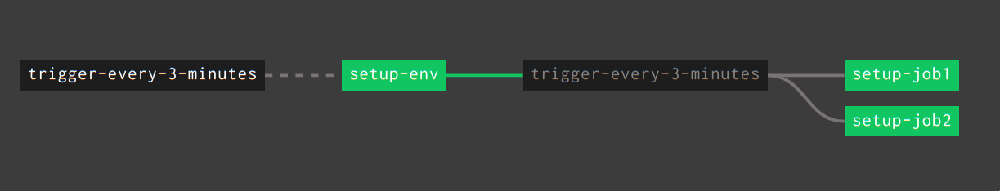

# Start independent jobs manually in batch

## Problem

I want to be able to start a set of independent jobs manually,
where there is no resource change to trigger them all.

## Use case

I want to setup an environment with a concourse pipeline. There
are multiple jobs to do, like create a database, create an s3 
bucket, define a user provided service, etc.. I want to start
them all manually, on demand by starting one job that would 
trigger all the others. I cannot bound it to git resource as
it will not change each time I need to setup/fix the envionment.


## Requirements

None.

## Idea

Based on https://github.com/pivotalservices/concourse-pipeline-samples/tree/master/concourse-pipeline-patterns/time-triggered-pipelines

I need a job that does nothing else just triggers all the other jobs. All of the jobs depens on a time resource, but the first one
does not triggers and all the others are dependent of the first job.

## Solution



```yml
---
resources:
- name: trigger-every-3-minutes
  type: time
  source:
    interval: 3m

jobs:
- name: setup-env
  plan:
  - get: trigger-every-3-minutes

- name: setup-job1
  plan:
  - get: trigger-every-3-minutes
    trigger: true
    passed: [setup-env]
  # the real job to do comes here

- name: setup-job2
  plan:
  - get: trigger-every-3-minutes
    trigger: true
    passed: [setup-env]

  # the real job to do comes here
```

For a more complex hands on exemple extracted from one of my pipelines check [Hands on pipeline](pipeline2.yml). It creates 
some resources is PWS and uses terraform to provision a S3 (terraform source not provided).
